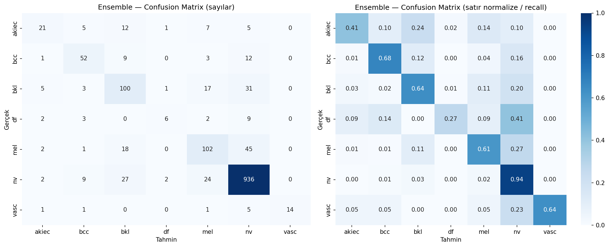
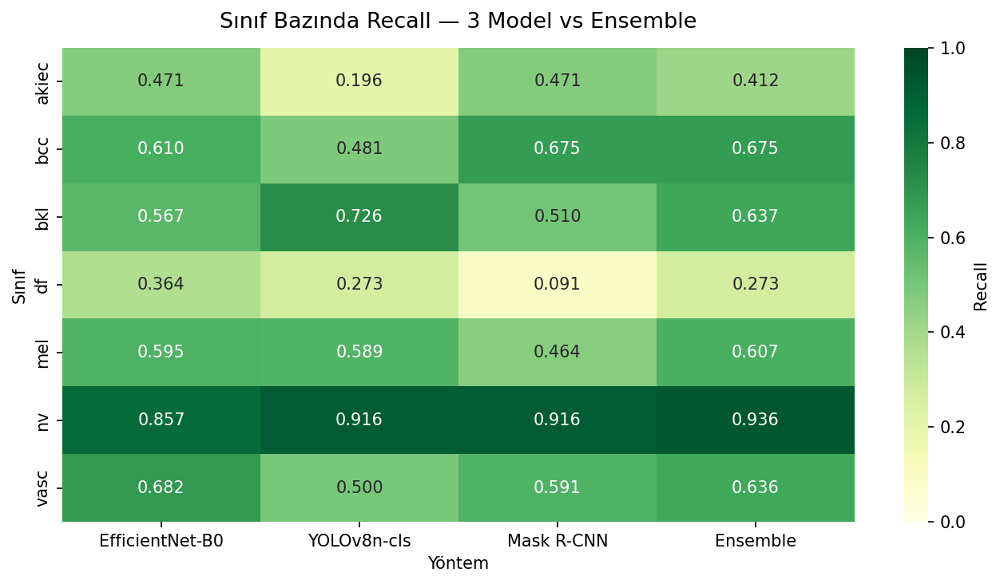

[README.md](https://github.com/user-attachments/files/27315983/README.md)
# 🔬 HAM10000 Cilt Kanseri Sınıflandırma — Çoklu Model + Ensemble

> Yedi sınıflı dermatoskopik görüntü sınıflandırma için **EfficientNet-B0**, **YOLOv8n-cls** ve **Mask R-CNN ResNet50-FPN v2** modellerinin eğitilmesi ve **soft voting ensemble** ile birleştirilmesi.

[](https://www.python.org/)
[](https://pytorch.org/)
[](https://optuna.org/)
[](https://www.nvidia.com/)
[](LICENSE)

---

## 📑 İçindekiler

- [Proje Özeti](#-proje-özeti)
- [Öne Çıkan Sonuçlar](#-öne-çıkan-sonuçlar)
- [Pipeline](#-pipeline)
- [Veri Seti](#-veri-seti)
- [Modeller](#-modeller)
- [Sonuçlar](#-sonuçlar)
- [Sınıf Bazında Performans](#-sınıf-bazında-performans)
- [Kullanım](#-kullanım)
- [Dosya Yapısı](#-dosya-yapısı)
- [Atıf](#-atıf)

---

## 🎯 Proje Özeti

Bu çalışmada **HAM10000** dermatoskopik görüntü veri seti üzerinde 7 sınıflı cilt lezyonu sınıflandırma problemi ele alınmıştır. Üç farklı mimaride model eğitilmiş ve soft voting ile birleştirilmiştir. Mimari çeşitliliğin sağladığı **tamamlayıcı hatalar** sayesinde ensemble, en iyi tek modele göre **macro F1'de +6.9 puan** kazanım sağlamıştır.

| Özellik | Detay |
|---|---|
| 📦 **Veri Seti** | HAM10000 (10.015 dermatoskopik görüntü, 7 sınıf) |
| 🧠 **Modeller** | EfficientNet-B0, YOLOv8n-cls, Mask R-CNN ResNet50-FPN v2 |
| 🎨 **Önişleme** | Otsu eşikleme + morfoloji ile ROI tespiti (224×224) |
| 🔍 **Hiperparametre** | Optuna (15 trial × 6 epoch) |
| 🛡️ **Veri Sızıntısı Önleme** | Lezyon-tabanlı stratified split (seed=42) |
| 🤝 **Ensemble** | Soft voting (eşit ağırlık 1/3) |
| 💻 **Ortam** | Google Colab Pro (A100 / T4 GPU) |

---

## 🏆 Öne Çıkan Sonuçlar

| Model | Test Accuracy | Macro F1 | Weighted F1 | Parametre |
|---|---|---|---|---|
| EfficientNet-B0 | 0.7615 | 0.5740 | 0.7695 | 5.3 M |
| YOLOv8n-cls | 0.7969 | 0.5710 | 0.7907 | 2.7 M |
| Mask R-CNN | 0.7782 | 0.5458 | 0.7675 | 43.9 M |
| **🥇 ENSEMBLE** | **0.8223** | **0.6430** | **0.8169** | — |

**Ensemble Kazançları (en iyi tek modele göre):**
- 🎯 Accuracy: **+2.54 puan**
- 🎯 Macro F1: **+6.90 puan** ⭐
- 🎯 Weighted F1: **+2.62 puan**

---

## 🏗️ Pipeline

```
HAM10000 (10.015 görüntü)
        │
        ▼
┌───────────────────────┐
│ Lezyon-Tabanlı Split  │  seed=42, stratified
│ Train: 7054           │  (data leakage önleme)
│ Val:   1464           │
│ Test:  1497           │
└───────────────────────┘
        │
        ▼
┌──────────────────────────────────┐
│ ROI Önişleme                     │
│ Otsu + Morfoloji + %15 Padding   │
│ → 224×224 RGB                    │
│ MD5 cache (Optuna trial'larda    │
│  yeniden hesaplama yok)          │
└──────────────────────────────────┘
        │
        ▼
┌────────────────┬─────────────────┬──────────────┐
│ EfficientNet   │  YOLOv8n-cls    │  Mask R-CNN  │
│ 2 aşamalı      │  Tek aşama      │  2 aşamalı   │
│ classifier+ft  │  Ultralytics    │  AMP/fp16    │
└────────┬───────┴────────┬────────┴───────┬──────┘
         │                │                │
         └────────────────┴────────────────┘
                          │
                          ▼
              ┌─────────────────────────┐
              │ Soft Voting Ensemble    │
              │ P = (P₁ + P₂ + P₃) / 3  │
              └─────────────────────────┘
```

---

## 📊 Veri Seti

[**HAM10000**](https://www.kaggle.com/datasets/kmader/skin-cancer-mnist-ham10000) (Tschandl et al., 2018) 10.015 dermatoskopik görüntü ve 7 farklı tanı sınıfı içermektedir. Yüksek **sınıf dengesizliği** dikkat çekicidir.

| Kısaltma | Tam Adı | Örnek | Oran |
|---|---|---:|---:|
| `akiec` | Aktinik Keratoz / İntraepitelyal Karsinom | 327 | %3.3 |
| `bcc` | Bazal Hücreli Karsinom | 514 | %5.1 |
| `bkl` | Selim Keratoz Benzeri Lezyonlar | 1099 | %11.0 |
| `df` | Dermatofibroma | 115 | %1.1 |
| `mel` | Melanom | 1113 | %11.1 |
| `nv` | Melanositik Nevüs | 6705 | %66.9 |
| `vasc` | Vasküler Lezyonlar | 142 | %1.4 |

**Mask R-CNN için ek olarak** [Tschandl Lesion Segmentations](https://www.kaggle.com/datasets/tschandl/ham10000-lesion-segmentations) veri setindeki 10.015 piksel-düzeyinde maske ground truth olarak kullanılmıştır.

---

## 🧠 Modeller

### 1️⃣ EfficientNet-B0
- **Mimari:** Compound scaling tabanlı CNN (Tan & Le, 2019)
- **Eğitim:** 2 aşamalı transfer learning
  - Aşama 1: Sınıflandırıcı eğitimi (50 epoch, donmuş backbone)
  - Aşama 2: Fine-tuning (30 epoch, tüm ağırlıklar açık)
- **Sınıf dengesizliği:** sqrt yumuşatma + clip 3.0 sınıf ağırlıkları + label smoothing 0.1
- **Test:** Acc 0.7615 / Macro F1 0.5740

### 2️⃣ YOLOv8n-cls
- **Mimari:** Ultralytics YOLOv8 nano sınıflandırma varyantı
- **Eğitim:** Tek aşama (50 epoch, mosaic + mixup augmentation)
- **Avantaj:** En hafif model (2.7M parametre, mobile-ready)
- **Test:** Acc 0.7969 ⭐ / Macro F1 0.5710

### 3️⃣ Mask R-CNN ResNet50-FPN v2
- **Mimari:** PyTorch torchvision Mask R-CNN (He et al., 2017)
- **Eğitim:** Detection + segmentation (Tschandl maskeleriyle), AMP/fp16
- **Avantaj:** Lezyon sınırı bilgisi sayesinde azınlık sınıflarda güçlü recall
- **Test:** Acc 0.7782 / Macro F1 0.5458

### 4️⃣ Ensemble (Soft Voting)
```
P_ensemble(c|x) = (1/3) × [P_EfficientNet(c|x) + P_YOLOv8(c|x) + P_MaskRCNN(c|x)]
```
- Eşit ağırlık tercih edildi: 3 modelin F1 skorları yakın (0.55–0.59)
- **Sonuç:** Acc 0.8223 ⭐ / Macro F1 0.6430 ⭐

---

## 📈 Sonuçlar

### Karşılaştırma Tablosu

| Metrik | EfficientNet-B0 | YOLOv8n-cls | Mask R-CNN | **Ensemble** |
|---|:---:|:---:|:---:|:---:|
| Accuracy | 0.7615 | **0.7969** | 0.7782 | **0.8223** ⭐ |
| F1 (macro) | **0.5740** | 0.5710 | 0.5458 | **0.6430** ⭐ |
| F1 (weighted) | 0.7695 | **0.7907** | 0.7675 | **0.8169** ⭐ |

### Confusion Matrix — Ensemble



> Ensemble nv sınıfında %93.6 recall ile en yüksek değere ulaşmıştır. Akiec, bcc, bkl, mel ve vasc sınıflarında recall %41-68 aralığındadır.

---

## 🎨 Sınıf Bazında Performans

### Recall Heatmap (3 Model + Ensemble)



**Önemli gözlem:** Modeller farklı sınıflarda lider olduğundan **tamamlayıcı hatalar** üretmektedir. Bu çeşitlilik soft voting ensemble'ın başarısının temel nedenidir.

| Sınıf | Lider Model | Recall |
|---|---|---:|
| akiec | EfficientNet & Mask R-CNN | 0.471 |
| bcc | Mask R-CNN | 0.675 |
| bkl | YOLOv8n-cls | 0.726 |
| df | EfficientNet-B0 | 0.364 |
| mel | EfficientNet-B0 | 0.595 |
| nv | YOLOv8n-cls & Mask R-CNN | 0.916 |
| vasc | EfficientNet-B0 | 0.682 |

### Ensemble — Sınıf Bazında Detay

| Sınıf | Precision | Recall | F1 | Support |
|---|---:|---:|---:|---:|
| akiec | 0.6176 | 0.4118 | 0.4941 | 51 |
| bcc | 0.7027 | 0.6753 | 0.6887 | 77 |
| bkl | 0.6024 | 0.6369 | 0.6192 | 157 |
| df | 0.6000 | 0.2727 | 0.3750 | 22 |
| mel | 0.6538 | 0.6071 | 0.6296 | 168 |
| nv | 0.8974 | 0.9360 | 0.9163 | 1000 |
| vasc | **1.0000** | 0.6364 | 0.7778 | 22 |
| **macro avg** | 0.7249 | 0.5966 | **0.6430** | 1497 |
| **weighted avg** | 0.8167 | 0.8223 | 0.8169 | 1497 |

---

## 🚀 Kullanım

### Gereksinimler
```bash
pip install torch torchvision ultralytics optuna
pip install opencv-python scikit-learn pandas matplotlib seaborn
pip install kaggle  # HAM10000 indirmek için
```

### Notebook'ları Çalıştırma Sırası

Notebook'lar **Google Colab Pro** için optimize edilmiştir. Tüm çıktılar otomatik olarak Google Drive'a yedeklenir.

```bash
# 1. EfficientNet-B0 eğit (~30-45 dk A100)
Cilt_Kanseri_EfficientNet-B0.ipynb

# 2. YOLOv8n-cls eğit (~20 dk A100)
Cilt_Kanseri_YOLOv8.ipynb

# 3. Mask R-CNN eğit (~3.5 saat A100)
Cilt_Kanseri_MaskRCNN.ipynb

# 4. Ensemble (~30 saniye, CPU yeterli)
Cilt_Kanseri_Ensemble.ipynb
```

Her notebook şunları otomatik yapar:
1. Google Drive mount
2. `kaggle.json` yükleme (manuel)
3. HAM10000 dataset indirme
4. ROI önişleme + caching
5. Optuna hiperparametre optimizasyonu
6. Model eğitimi
7. Test prediction (probabilities + labels → `.npy`)
8. **Drive'a otomatik yedekleme** (kritik — session ölmeden önce)

### Tekrarlanabilirlik
- Tüm modellerde `seed=42`
- Lezyon-tabanlı stratified split → 3 modelde de **birebir aynı test seti** (1497 görüntü)
- Aynı önişleme: Otsu + morfoloji + %15 padding ROI

---

## 📁 Dosya Yapısı

```
skin-cancer/
├── Cilt_Kanseri_EfficientNet-B0.ipynb   # 1️⃣ EfficientNet eğitim
├── Cilt_Kanseri_YOLOv8.ipynb            # 2️⃣ YOLOv8n-cls eğitim
├── Cilt_Kanseri_MaskRCNN.ipynb          # 3️⃣ Mask R-CNN eğitim
├── Cilt_Kanseri_Ensemble.ipynb          # 4️⃣ Soft voting ensemble
└── README.md
```

### Drive'da Üretilen Çıktılar
```
cilt_kanseri_ensemble/
├── probabilities_efficientnet_b0.npy   # (1497, 7) — ensemble girdisi
├── probabilities_yolov8n_cls.npy       # (1497, 7) — ensemble girdisi
├── probabilities_maskrcnn.npy          # (1497, 7) — ensemble girdisi
├── test_labels_efficientnet_b0.npy     # (1497,)
├── test_labels_yolov8n_cls.npy         # (1497,)
├── test_labels_maskrcnn.npy            # (1497,)
├── best_efficientnet_b0.pth            # 18 MB
├── best_yolov8n_cls.pt                 # 2.8 MB
├── maskrcnn_best.pth                   # 175 MB
├── confusion_matrix_*.png/jpg          # 4 adet (3 model + ensemble)
├── recall_heatmap_ensemble.png
└── optuna_study_*.pkl                  # 3 adet
```

---

## 🔬 Metodolojik Notlar

### Veri Sızıntısının Önlenmesi
HAM10000'de aynı lezyonun birden fazla görüntüsü bulunabilir. Rastgele bölme aynı lezyonun farklı görüntülerini hem train hem test'e sokarak **sahte yüksek metriği** üretebilir. Bu çalışmada bölme `lesion_id` üzerinden yapılarak engellendi.

### Optuna Arama Uzayı
Akademik kısıtla bilinçli olarak dar tutulmuştur:
| Hiperparametre | Aralık |
|---|---|
| `learning_rate` | [1e-4, 3e-3] (log-uniform) |
| `dropout` | [0.2, 0.5] |
| `weight_decay` | [1e-5, 1e-3] (log-uniform) |
| `batch_size` | {32, 64} (Eff/YOLO), {4, 8} (Mask R-CNN, VRAM kısıtı) |

### Sınıf Dengesizliği
- **EfficientNet:** Custom class weights (sqrt yumuşatma + clip 3.0)
- **YOLOv8:** Built-in mosaic + mixup augmentation
- **Mask R-CNN:** Detection-tabanlı doğal robustluk

---

## ⚠️ Sınırlılıklar

- 📍 Veri seti tek kuruma ait (Medical University of Vienna) → genellenebilirlik kısıtlı
- 📷 Dermatoskopik görüntülerle eğitildi — akıllı telefon kameraları için domain shift var
- 🔬 Klinik kullanımdan önce dış doğrulama (external validation) gerekli
- ⚕️ **Tıbbi tanı aracı değildir** — sadece araştırma amaçlı

---

## 🔮 Gelecek Çalışmalar

- [ ] Vision Transformer (ViT, Swin) ekleyerek 4-model ensemble
- [ ] Stacking veya Bayesian model averaging
- [ ] df ve akiec için focal loss + GAN-tabanlı veri artırımı
- [ ] Grad-CAM / SHAP ile açıklanabilirlik
- [ ] Mobile uygulama (TFLite export + Flutter)
- [ ] PH2, ISIC veri setlerinde cross-dataset validation

---

## 📚 Atıf

Bu çalışma akademik bir bitirme projesi olarak hazırlanmıştır. Kullanılan başlıca kaynaklar:

- Tschandl, P., Rosendahl, C., & Kittler, H. (2018). *The HAM10000 dataset: a large collection of multi-source dermatoscopic images of common pigmented skin lesions.* Scientific Data, 5, 180161.
- Tan, M., & Le, Q. V. (2019). *EfficientNet: Rethinking Model Scaling for Convolutional Neural Networks.* ICML.
- He, K., Gkioxari, G., Dollár, P., & Girshick, R. (2017). *Mask R-CNN.* ICCV.
- Akiba, T., et al. (2019). *Optuna: A Next-generation Hyperparameter Optimization Framework.* KDD.
- Ultralytics. (2023). *YOLOv8.* GitHub: https://github.com/ultralytics/ultralytics

---

## 📝 Lisans

Bu proje akademik amaçla geliştirilmiştir. HAM10000 veri seti kendi lisansına tabidir (CC BY-NC 4.0).

---

<p align="center">
  <i>Made with ❤️ for academic research</i><br>
  <i>HAM10000 + EfficientNet + YOLOv8 + Mask R-CNN + Ensemble</i>
</p>
